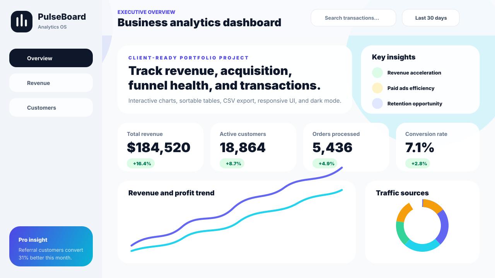

# PulseBoard — Business Analytics Dashboard

A polished, responsive analytics dashboard built to demonstrate production-ready frontend skills for SaaS, e-commerce, and B2B teams.



## Live Demo

Deploy this project to Vercel or Netlify, then replace this line with your live URL:

https://business-analytics-dashboard-henna.vercel.app/


## Why this project attracts clients

This repository is intentionally designed around problems businesses pay frontend developers to solve:

- Turning business metrics into a clear executive dashboard
- Building responsive SaaS-style product interfaces
- Creating reusable UI components with TypeScript
- Visualizing revenue, acquisition, and conversion data
- Handling real-world UI states such as search, filtering, sorting, export, and dark mode

## Features

- Mobile-first dashboard layout with desktop sidebar, mobile drawer, and bottom mobile navigation
- KPI cards for revenue, customers, orders, and conversion rate
- Interactive revenue/profit area chart
- Acquisition channel bar chart
- Traffic source donut chart
- Conversion funnel visualization
- Mobile transaction cards and desktop sortable table powered by TanStack Table
- Search and status filters
- CSV export for filtered transaction records
- Dark/light mode toggle
- Accessible skip link, labels, focus states, and semantic sections
- Responsive buttons/dropdowns for navigation, notifications, profile actions, filters, export, and demo actions
- Deployment-ready Vite configuration for Vercel and Netlify

## Tech Stack

- React
- TypeScript
- Vite
- Tailwind CSS
- Recharts
- TanStack Table
- Lucide React icons

## Getting Started

If your editor terminal does not work, see [`RUN_LOCALLY.md`](RUN_LOCALLY.md).

```bash
# 1. Install dependencies
npm install

# 2. Start local dev server
npm run dev

# 3. Create production build
npm run build

# 4. Preview production build
npm run preview
```

## Project Structure

```txt
business-analytics-dashboard/
├── docs/
│   └── dashboard-preview.svg
├── public/
│   └── favicon.svg
├── src/
│   ├── components/
│   │   ├── charts/
│   │   ├── layout/
│   │   ├── tables/
│   │   └── ui/
│   ├── data/
│   │   └── mockData.ts
│   ├── App.tsx
│   ├── index.css
│   └── main.tsx
├── netlify.toml
├── vercel.json
└── package.json
```

## Deployment

### Deploy to Vercel

```bash
npm install
npm run build
npx vercel --prod
```

Or import the GitHub repository in Vercel and use:

```txt
Framework Preset: Vite
Build Command: npm run build
Output Directory: dist
```

### Deploy to Netlify

```bash
npm install
npm run build
npx netlify deploy --prod --dir=dist
```

Or import the GitHub repository in Netlify. The included `netlify.toml` sets the build command and publish directory.

## Suggested GitHub Repository Description

```txt
A responsive business analytics dashboard built with React, TypeScript, Tailwind CSS, Recharts, and TanStack Table.
```

## Suggested Pinned Repo Caption

```txt
Client-ready analytics dashboard with KPI cards, charts, sortable transactions, CSV export, dark mode, and responsive SaaS UI.
```

## Portfolio Case Study Angle

You can describe this as:

> I designed and built a client-ready analytics dashboard for a fictional SaaS business. The project focuses on responsive layouts, data visualization, accessible UI components, sortable/filterable transaction data, dark mode, and deployment-ready frontend architecture.

## License

MIT — feel free to use this as a portfolio project or client-facing starter.
